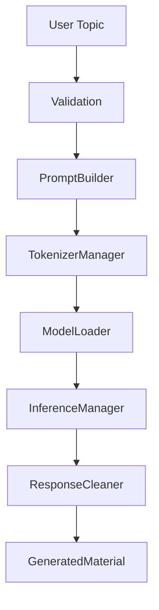

# AI Pipeline

Prompt 3 adds the backend boundary for local open-source generation.

## Default Model

Recommended default: `Qwen/Qwen2.5-0.5B-Instruct`.

Reason: it is small, instruction-tuned, compatible with Hugging Face Transformers, and uses an Apache-2.0 license. The model id is configurable through `ModelConfig`, so it can be replaced by SmolLM2, TinyLlama, Phi, Gemma, or another local model later.

## Runtime Flow



## Dependency Note

The backend modules are importable without heavy AI packages. Real inference requires:

```bash
pip install -r requirements-ai.txt
```

Training requires additional packages:

```bash
pip install -r requirements-training.txt
```

The app should still launch without those packages.
