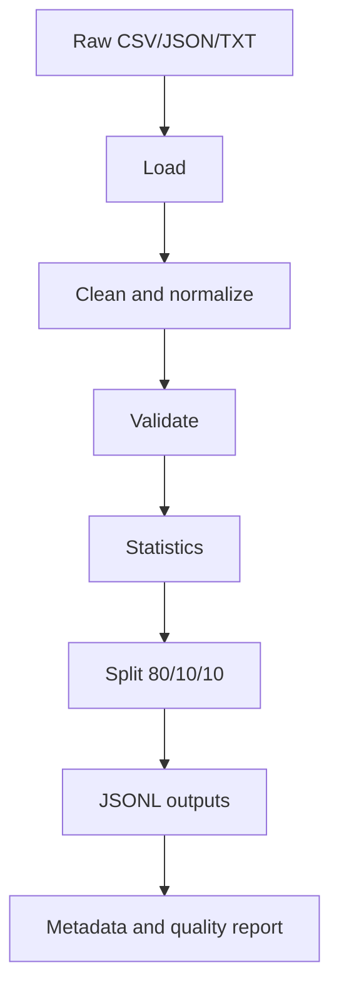

# Data Engineering Pipeline

Prompt 4.5 adds a reusable data pipeline for educational fine-tuning data.

## Recommended Dataset Combination

| Dataset | License | Purpose | Contribution |
| --- | --- | --- | --- |
| `allenai/sciq` | CC BY-NC 3.0 | Science QA and distractors | Quiz and answer-key quality |
| `databricks/databricks-dolly-15k` | CC BY-SA 3.0 | Instruction-following | Structured educational responses |
| `OpenAssistant/oasst1` | Apache 2.0 | Assistant conversations | Natural explanation style |
| OpenStax textbooks | CC BY 4.0 | Open educational textbooks | Reliable academic source material |

Use this mix because no single dataset covers all EduGen outputs. SciQ helps quizzes, Dolly helps instruction following, OASST helps assistant tone, and OpenStax improves educational coverage.

## Pipeline



## Output Structure

```text
datasets/
├── raw/
├── processed/
├── train/
├── validation/
├── test/
├── metadata/
├── cache/
├── statistics/
└── downloads/
```

The 80/10/10 split is the default because it keeps most data for training while preserving enough validation and test data for reproducible comparison.

## Run

```bash
PYTHONPATH=src python -m edugen.ai.data.run_pipeline
```

Optional chart PNGs require:

```bash
pip install -r requirements-data.txt
```
